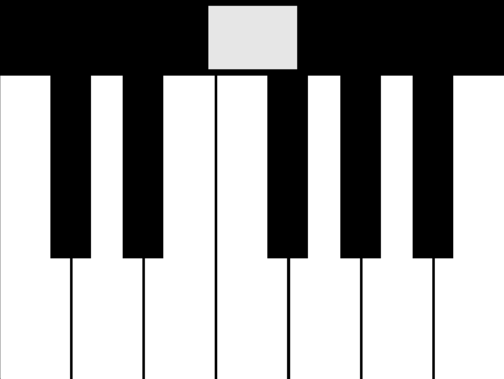

# PIC18F Piano

Control the piano with PIC18F4520, buttons, and a variable resistor.

Implemented by PIC18F and Python (pygame, pyserial).

## PIC18F

CCP1 - variable resistor (change octave).

RA1-RA7, RB4-RB0 - buttons (C to B).

## Python

``` shell
pip install pygame pyserial
python -u ./python/main.py
```


